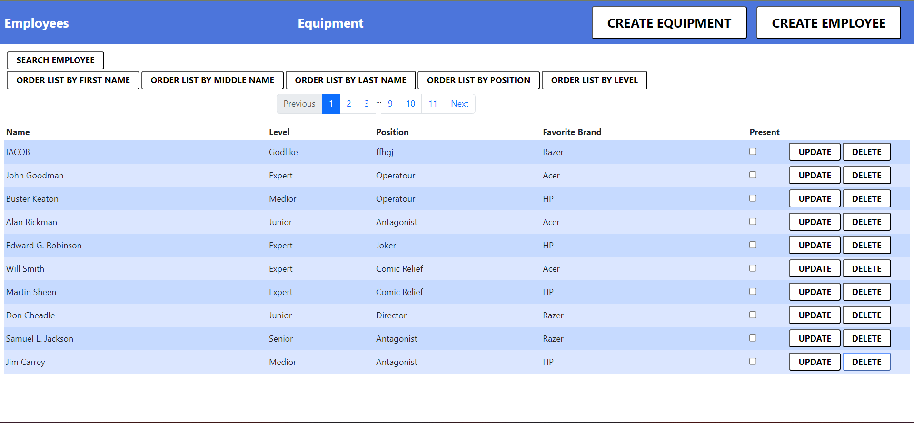

# EmployeeMadness

## Project descriprion

### Application Utilities
In this project, I monitor my employees to keep records of their attendance, the tools they are working with, favorite brands, etc. I can also sort the employees by level or position, order them alphabetically by first names or last names, add, remove, and update our employee list, search by name, and even identify the missing ones. I have also implemented the equipment section with almost the same properties as the employees, including CRUD operations. Additionally, I have implemented pagination. 



### Technologies
For this project, I used React with JavaScript for the frontend and Express for the server side. I used Bootstrap and CSS for styling. I recently learned to use these technologies, and I have developed a strong liking for them.

### Upcoming Features
Most probably, an improved styling will be introduced. Additionally, I am planning to implement a feature that allows employees to keep a record of their own work for the day, along with the number of hours they worked. These are the current ideas in consideration.


# Employee Data (INITIALIZE THE PROJECT)

## Server side

### Install dependencies
```bash
cd ./server
npm install
```

### .env file
Copy the .env.sample as .env and fill up the environment variable for your personal mongodb connecttion url.

### Prepare the database

```bash
cd ./server
npm run populate
```

**populate command** will run the populate.js file as a script and it will generate a buch of starter data for your database. 

### Running the code

```bash
cd ./server
npm run dev
```

It will start the server with nodemon. So it will watch the changes and restart the server if some ot the files changed.

### Testing with test.http

If you like to try the endpoints of the rest api, you can check the test.http file for urls are should work on your environment as well. And if you install the [REST Client](https://marketplace.visualstudio.com/items?itemName=humao.rest-client) extenstion for vscode you can actually run those in your editor.


## Client side

### Install dependencies

```bash
cd ./client
npm install
```

### Proxy

Watch for the port of your rest api. By default it will bind on port 8080 and the frontend proxy settings also depend on this configuration. If you for some reasons change the port of the backend, don't forget to change the ./client/package.json proxy settings as well.

### Runnig the code

```bash
cd ./client
npm start
```

And the create-react-app react-scripts package will start your frontend on the 3000 port and you can visit the http://localhost:3000 on your preferred browser.
